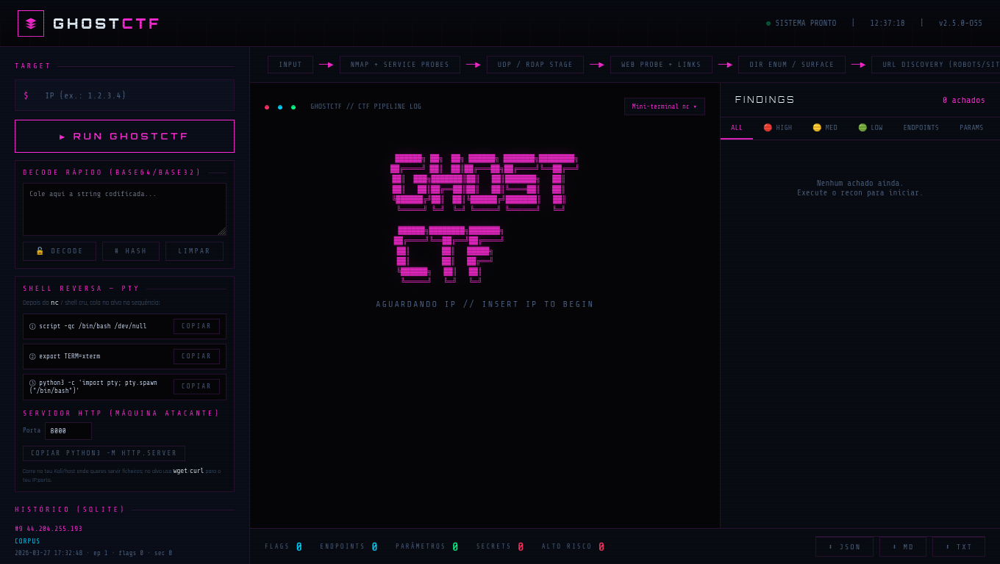

<div align="center">

# GHOSTCTF

**Console web e API de recon automatizado para Capture The Flag** — um pipeline único que junta `nmap`, provas HTTP, enumeração de diretórios, deteção de flags, playbooks e dezenas de módulos opcionais, com histórico e exportação.

[](https://nodejs.org/)
[](./LICENSE)



*UI escura, pipeline por etapas, terminal de log, decode rápido, cheats de shell reversa, histórico e triagem de achados.*

</div>

---

## O que é

O **GHOSTCTF** é uma aplicação **Node.js** (Express) que serve uma **SPA** (`index.html`) e expõe APIs para:

| Caminho | Uso |
|--------|-----|
| **CTF por IP** (`/api/ghostctf/stream`) | Alvo **IPv4** — `nmap`, curl web (IP e nomes em `/etc/hosts`), `robots.txt`, rastreio de links, **ffuf / gobuster / dirb**, flags (Solyd, HackTheBox, Google CTF), playbook, LFI/SQLMap opcionais, WPScan, FTP/SSH/MySQL, Exploit-DB, vhost/sitemap, disclosure, etc. Stream **NDJSON** em tempo real. |
| **Recon por domínio** (`/api/recon/stream`) | **Domínio** — subdomínios, DNS, RDAP, Wayback, Common Crawl, análise de JS, dorks, modo **Kali** opcional (ferramentas no `PATH`). |

Os runs podem ser **persistidos** em **SQLite** (local) ou **Postgres / Supabase**.

---

## Funcionalidades (destaques)

- **Pipeline visual** — etapas tipo *INPUT → Nmap + serviços → UDP/RDAP → Web + links → Dir enum / superfície → descoberta de URLs*, com progresso e logs.
- **Findings** — triagem por prioridade (HIGH / MED / LOW), endpoints, parâmetros, flags e secrets; contadores em tempo real.
- **Decode / hash / crack** — Base64, Base32, operações de hash e integração com ferramentas do sistema (ex.: John) na própria UI.
- **Shell reversa (PTY)** — atalhos copiáveis (`script`, `TERM`, `python3 -c pty…`) e servidor HTTP rápido para transferir ficheiros.
- **Mini-terminal** — integração com fluxo de trabalho (ex.: `nc`), configurável por variáveis de ambiente.
- **Exportação** — relatórios em **JSON**, **Markdown** e **TXT**.
- **Histórico** — lista de execuções anteriores (quando usas base de dados).

Plataformas de flag suportadas no núcleo: **Solyd**, **HackTheBox**, **Google CTF** (regex e validação em `server/ghostctf/platforms.js`).

---

## Requisitos

- **Node.js** ≥ 18  
- **`nmap`** no sistema para o pipeline principal por IP  
- **Kali** ou ferramentas equivalentes no `PATH` para módulos agressivos / recon por domínio com `kaliMode` (opcional)

---

## Arranque rápido

```bash
git clone <teu-repo> && cd ghostctf
npm install
cp .env.example .env
# Editar .env: PORT (padrão 3847), DATABASE_URL ou Supabase se quiseres cloud
npm start
```

Abre **`http://127.0.0.1:3847`**. A UI e a API partilham a mesma origem.

```bash
npm run dev    # servidor com --watch
npm test       # testes em server/tests/
```

---

## Docker

```bash
docker build -t ghostctf .
docker run --rm -p 3847:3847 --env-file .env ghostctf
```

---

## Configuração

Variáveis principais (ver **`.env.example`**):

| Variável | Função |
|----------|--------|
| `PORT` | Porta HTTP (default `3847`) |
| `DATABASE_URL` / `SUPABASE_*` | Persistência Postgres |
| `GHOSTCTF_RL_MAX` / `GHOSTCTF_RL_WINDOW_MS` | Rate limit dos POST de stream |
| `GHOSTCTF_WEBHOOK_URL` | Webhook após run gravado (ex.: Discord) |
| `GHOSTCTF_FORCE_KALI` | Forçar deteção “estilo Kali” fora do Kali |
| `VIRUSTOTAL_API_KEY`, `GOOGLE_CSE_*`, `GITHUB_TOKEN` | Módulos opcionais no recon por domínio |

*Compatibilidade:* o código aceita ainda prefixos `GHOSTRECON_*` em várias variáveis (legado).

Se abrires o `index.html` via `file://`, define `localStorage.setItem('ghostctf_api_base', 'http://127.0.0.1:3847')`.

---

## API (resumo)

| Método | Rota | Descrição |
|--------|------|-----------|
| `GET` | `/api/health` | Healthcheck |
| `GET` | `/api/capabilities` | Ferramentas detetadas no host |
| `POST` | `/api/recon/stream` | Recon por **domínio** |
| `POST` | `/api/ghostctf/stream` | Pipeline **CTF por IP** |
| `POST` | `/api/ghostctf/decode` | Decode / extração de flags |
| `POST` | `/api/ghostctf/hash` / `hash-crack` / `john-crack` | Hash e cracking |
| `GET` | `/api/runs`, `/api/runs/:id` | Runs guardados |

Detalhes de corpos e módulos: `server/index.js`.

---

## Estrutura do repositório

```
server/
  index.js           # Express, rotas, NDJSON streams
  config.js          # UA, limites, rate limit
  modules/           # DNS, probe, DB, integrações, Kali, …
  ghostctf/          # Pipeline CTF: nmap-scan, web-curl, dir-enum, flags, playbook, …
index.html           # Interface GHOSTCTF
supabase/            # Migrações (opcional)
Dockerfile
.env.example
LICENSE              # MIT
GhostCtf.png         # Captura da UI
```

---

## Segurança e ética

Usa o GHOSTCTF **apenas em alvos autorizados** (labs de CTF, ambientes próprios, programas com permissão explícita). Scans agressivos, enumeração e exploração automatizada podem ser **ilegais** ou violar termos de serviço noutros contextos. **A responsabilidade é sempre tua.**

---

## Licença

Este projeto usa a [**Licença MIT**](./LICENSE): é **permissiva** — qualquer pessoa pode usar, modificar e redistribuir o código, inclusive em projetos privados ou comerciais, mantendo o aviso de copyright. **Não** exige publicar alterações (ao contrário de licenças *copyleft* como a AGPL) e é a opção habitual para ferramentas open source quando queres máxima liberdade para ti e para quem forkar, com texto jurídico simples e reconhecido em todo o lado.

---

## Créditos

Desenvolvido para acelerar **recon e automação em CTF** num único painel, com backend extensível em JavaScript (ES modules).
