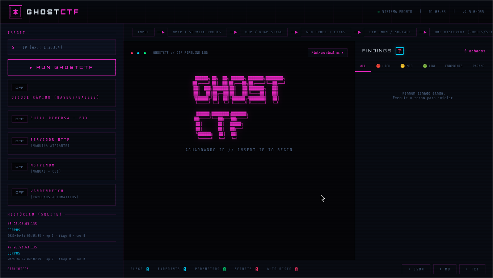

<div align="center">

# GHOSTCTF

**Console web e API de recon automatizado para Capture The Flag** — pipeline por IP (`nmap`, web, diretórios, flags, playbooks), dezenas de módulos opcionais (LFI, SQLMap, WordPress, superfície de upload, Langflow, brute SSH/WP, etc.), **payloads** (texto + **msfvenom**), integração **ngrok** / **mini-nc**, histórico e exportação.

[](https://nodejs.org/)
[](./LICENSE)



*UI escura, pipeline por etapas, terminal de log, decode rápido, cheats de shell reversa, Wandenreich, histórico e triagem de achados.*

</div>

---

## O que é

O **GHOSTCTF** é uma aplicação **Node.js** (Express + **WebSocket** para o mini-`nc`) que serve a interface (`index.html`) e expõe APIs para:

| Caminho | Uso |
|--------|-----|
| **`POST /api/ghostctf/stream`** | Alvo **IPv4** — `nmap`, `curl` web (IP e hostnames extra), `robots.txt`, rastreio de links, **ffuf / gobuster / dirb**, flags (Solyd, HackTheBox, Google CTF), playbook, LFI/SQLMap/SQLMap-WS, WPScan, FTP/SSH/MySQL, Exploit-DB, vhost/sitemap, disclosure, cred reuse, upload surface, OpenAPI, vhost prefix fuzz, probes estendidos (mail/SMB), MySQL em IPs extra, Tiny File Manager, ActiveMQ, **SSH/WP brute (hydra)**, **Langflow (CVE-2025-3248 + vértices)**, etc. Resposta **NDJSON** em tempo real. |
| **`POST /api/recon/stream`** | **Domínio** — subdomínios, DNS, RDAP, Wayback, Common Crawl, análise de JS, dorks, modo **Kali** opcional (ferramentas no `PATH`). |

Os runs podem ser **persistidos** em **SQLite** (local), **Postgres** (`DATABASE_URL`) ou **Supabase** (API ou SQL).

---

## Funcionalidades (destaques)

### Pipeline e achados

- **Pipeline visual** — INPUT → Nmap + serviços → UDP/RDAP → Web + links → Dir enum / superfície → descoberta de URLs, com progresso e logs.
- **Findings** — triagem por prioridade (HIGH / MED / LOW), endpoints, parâmetros, flags e secrets; contadores em tempo real.
- **Exportação** — relatórios em **JSON**, **Markdown** e **TXT**.
- **Histórico** — lista de execuções e diff entre runs (com base de dados).
- **Intel / biblioteca** — corpus por alvo e conhecimento global (quando configurado).

### Sidebar (ferramentas CTF)

- **Cartões colapsáveis (ON/OFF)** — estado em `localStorage` (`ghostctf_sidebar_*_off`): Decode rápido, Shell reversa PTY, Servidor HTTP, Msfvenom (manual CLI), Wandenreich, blocos agressivos (SSH hydra, WP hydra, Langflow), Crack Mode.
- **Decode rápido** — Base64 / Base32; botão de hash rápido.
- **Shell reversa — PTY** — passos copiáveis (`script`, `TERM`, `python3 -c pty…`).
- **Servidor HTTP** — porta + copiar `python3 -m http.server` (máquina atacante).
- **Msfvenom (manual)** — LHOST/LPORT, ngrok, copiar comandos `msfvenom` / handler, descarregar `.php` pelo browser (não grava em `payloads/`).
- **Wandenreich** — grava em **`payloads/`** via API:
  - **Tipos em texto**: PHP reverse / webshell, `.sh`, `.py`, `.pl`, `.rb`, `.js` (Node), `.jsp`, PDF+PHP polyglot, `.ps1`.
  - **Ngrok** — ler API local ou arrancar `ngrok tcp` (variável `GHOSTCTF_NGROK_API`, default `http://127.0.0.1:4040`).
  - **Mini-nc** — após gravar reverse, opcional abrir listener na porta local (WebSocket ` /api/ghostctf/shell-ws`).
  - **Msfvenom automático** — `POST /api/ghostctf/msfvenom-build`: presets `.elf` / `.exe` / `.php` raw / `.war`; encoder **x86/shikata_ga_nai** só em presets x86 (requer `msfvenom` no PATH no host do Node).
  - **Manual (modal)** — pós-shell: enumeração, localizar upload, nota sobre `nc` vs `sessions` no Metasploit.
- **Crack Mode** — MD5 via API; **John the Ripper** integrado (`john-crack`).

### Módulos no painel “Modules” (pipeline CTF)

- **Plataformas de flag**: Solyd, HackTheBox, Google CTF (`server/ghostctf/platforms.js`).
- **Recon**: UDP scan, TCP all ports, Exploit-DB, LFI, SQLMap, SQLMap WebSocket, vhost/sitemap, **upload surface**, disclosure, cred reuse, WordPress focus, WPScan, **/etc/hosts** (repetir web por hostname).
- **Extended**: Tiny File Manager, ActiveMQ, mail/SMB, MySQL em IPs extra, OpenAPI, **vhost prefix fuzz**.
- **Agressivo** (só CTF autorizado): **SSH brute (hydra)** + wordlists Solyd (`wordlists/`) + hydra auto SecLists; **WP brute (hydra)**; **Langflow** (Host header, ngrok, vértices, `/flag.txt`).
- **Crack**: MD5 + John (formato, rules, incremental).

---

## Requisitos

| Componente | Obrigatório / opcional |
|------------|-------------------------|
| **Node.js** ≥ 18 | Obrigatório |
| **`nmap`** | Obrigatório para o pipeline principal por IP |
| **`curl`**, **`nc`** / **`ncat`** | Usados em probes e mini-terminal |
| **Kali** ou ferramentas no `PATH` | Opcional: `ffuf`, `gobuster`, `dirb`, `hydra`, `sqlmap`, `wpscan`, `searchsploit`, subfinder/amass, etc. |
| **`msfvenom`** | Só para **Gerar msfvenom → payloads/** no Wandenreich |
| **`ngrok`** | Só para botões “Iniciar ngrok tcp” na UI |
| **John the Ripper** | Só para Crack Mode → John |

---

## Arranque rápido

```bash
git clone https://github.com/Samuel-Ziger/GHOSTCTF.git
cd GHOSTCTF
npm install
cp .env.example .env
# Editar .env: PORT (padrão 3847), DATABASE_URL ou Supabase se quiseres cloud
npm start
```

Abre **`http://127.0.0.1:3847`**. A UI e a API partilham a mesma origem.

```bash
npm run dev    # servidor com --watch
npm test       # testes em server/tests/
```

Se abrires o `index.html` via `file://`, define no browser:

`localStorage.setItem('ghostctf_api_base', 'http://127.0.0.1:3847')`.

---

## Docker

```bash
docker build -t ghostctf .
docker run --rm -p 3847:3847 --env-file .env ghostctf
```

*Nota:* imagens mínimas podem não incluir `nmap`, `msfvenom` ou `hydra`; o pipeline completo espera ferramentas no sistema anfitrião ou imagem customizada.

---

## Configuração

Variáveis principais (ver **`.env.example`**):

| Variável | Função |
|----------|--------|
| `PORT` | Porta HTTP (default `3847`) |
| `DATABASE_URL` / `SUPABASE_*` | Postgres ou API Supabase |
| `GHOSTCTF_DB` | Caminho SQLite local (se não usares Supabase/Postgres) |
| `GHOSTCTF_RL_MAX` / `GHOSTCTF_RL_WINDOW_MS` | Rate limit dos POST de recon por domínio |
| `GHOSTCTF_WEBHOOK_URL` | Webhook JSON após run gravado |
| `GHOSTCTF_FORCE_KALI` | `1` — tratar host como Kali para deteção de ferramentas |
| `GHOSTCTF_NMAP_ARGS` | Argumentos extra ao `nmap` no recon por **domínio** (Kali) |
| `GHOSTCTF_NGROK_API` | URL da API ngrok local (default `http://127.0.0.1:4040`) |
| `GHOSTCTF_SHELL_WS_ANY` | `1` — WebSocket do mini-nc aceita origens não locais (só em ambiente confiável) |
| `VIRUSTOTAL_API_KEY`, `GOOGLE_CSE_*`, `GITHUB_TOKEN` | Módulos opcionais no recon por domínio |
| `GHOSTCTF_CC_CDX_API` | Common Crawl CDX (opcional) |
| `GHOSTCTF_WPSCAN_*` | WPScan (timeout / modo) |

*Compatibilidade:* o código aceita ainda prefixos **`GHOSTRECON_*`** em várias variáveis (legado).

---

## API (resumo)

| Método | Rota | Descrição |
|--------|------|-----------|
| `GET` | `/api/health` | Healthcheck |
| `GET` | `/api/capabilities` | Ferramentas detetadas no host |
| `POST` | `/api/recon/stream` | Recon por **domínio** (NDJSON) |
| `POST` | `/api/ghostctf/stream` | Pipeline **CTF por IP** (NDJSON) |
| `POST` | `/api/ghostctf/decode` | Decode Base64 / Base32 |
| `POST` | `/api/ghostctf/hash` | Hash rápido do texto |
| `POST` | `/api/ghostctf/payload-file` | Download de payload mínimo (corpo binário/texto) |
| `POST` | `/api/ghostctf/payload-save` | Grava payload em `payloads/` (tipos do `payload-kit`) |
| `POST` | `/api/ghostctf/msfvenom-build` | Corre `msfvenom` no servidor → `payloads/` |
| `POST` | `/api/ghostctf/ngrok-resolve` | Lê túneis ngrok → LHOST/LPORT TCP |
| `POST` | `/api/ghostctf/ngrok-tcp-start` | Arranca `ngrok tcp` (se disponível) |
| `POST` | `/api/ghostctf/hash-crack` | Crack MD5 (wordlist opcional) |
| `POST` | `/api/ghostctf/john-crack` | John the Ripper |
| `WS` | `/api/ghostctf/shell-ws` | Ponte para `nc` (mini-terminal na UI) |
| `GET` | `/api/runs`, `/api/runs/:id` | Runs guardados |
| `GET` | `/api/runs/:newerId/diff/:baselineId` | Diff entre dois runs |
| `GET` | `/api/intel/:target` | Intel por alvo |
| `GET` | `/api/knowledge` | Biblioteca de conhecimento |

Detalhes de corpos JSON: **`server/index.js`**.

---

## Estrutura do repositório

```
server/
  index.js              # Express, rotas HTTP, NDJSON, WebSocket
  config.js             # UA, limites, rate limit recon
  modules/              # DNS, RDAP, probe, DB (SQLite/PG/Supabase), Kali, VT, CSE, …
  ghostctf/
    pipeline.js         # Orquestração do run CTF por IP
    nmap-scan.js        # Nmap por IP
    web-curl.js         # HTTP paralelo a partir do nmap
    dir-enum.js         # ffuf / gobuster / dirb
    flag-detector.js    # Flags + decode encadeado
    playbook.js         # Sugestões pós-recon
    payload-kit.js      # Geração de payloads texto → payloads/
    msfvenom-wandenreich.js
    ngrok-local.js
    shell-ws.js         # WebSocket + spawn nc/ncat
    shell-auto-explore.js
    upload-surface.js
    lfi-probe.js, sqlmap-probe.js, sqlmap-ws-probe.js
    ssh-brute-probe.js, hydra-wp-brute-probe.js
    langflow-exploit-probe.js
    openapi-probe.js, vhost-prefix-fuzz.js, vhost-sitemap-probe.js
    extended-service-probe.js, activemq-probe.js, tinyfilemanager-probe.js
    disclosure-cred-probe.js, wordpress-focus-probe.js, extra-hosts-web.js
    …
  tests/
index.html              # Interface GHOSTCTF (SPA)
payloads/               # Saída gerada pela UI (ficheiros ignorados pelo git, mantém-se .gitkeep)
wordlists/              # usersolyd.txt / passwordsolyd.txt (módulo SSH Solyd)
HistoricoCTFsSolyd/     # Notas e artefactos de CTFs (opcional)
supabase/               # Migrações (opcional)
Dockerfile
.env.example
LICENSE                 # MIT
GhostCtf.png
```

---

## Segurança e ética

Usa o GHOSTCTF **apenas em alvos autorizados** (labs de CTF, ambientes próprios, programas com permissão explícita). Scans agressivos, brute force, payloads e exploração automatizada podem ser **ilegais** ou violar termos de serviço noutros contextos. **A responsabilidade é sempre tua.**

Não commits **`.env`**, chaves privadas nem hashes pessoais; ajusta **`.gitignore`** conforme necessário.

---

## Licença

Este projeto usa a [**Licença MIT**](./LICENSE): podes usar, modificar e redistribuir o código, inclusive em projetos privados ou comerciais, mantendo o aviso de copyright.

---

## Créditos

Desenvolvido para acelerar **recon e automação em CTF** num único painel, com backend extensível em **JavaScript** (ES modules).
