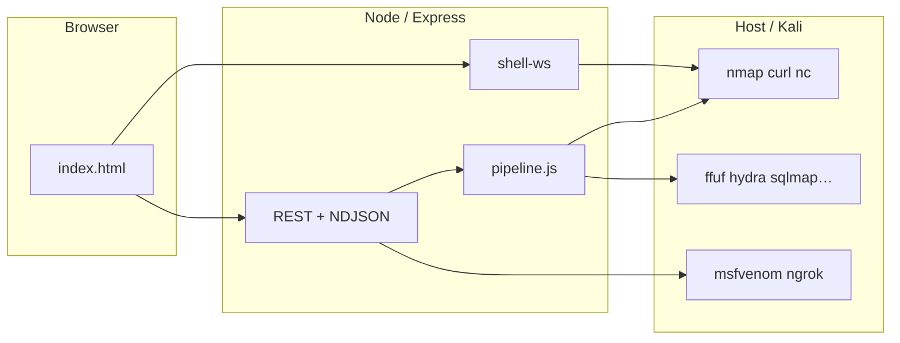

<div align="center">

# GHOSTCTF

**Console web + API para recon e automação em CTF**

Pipeline por IP com `nmap` e web em profundidade · módulos opcionais (LFI, SQLMap, WordPress, upload, Langflow, hydra…) · **payloads** (texto + **msfvenom**) · **ngrok** e mini-`nc` na UI · histórico e exportação

[](https://nodejs.org/)
[](./LICENSE)


*Pipeline por etapas, log em tempo real, decode, PTY, Wandenreich, findings e exportação.*

</div>

---

## Índice

- [Visão geral](#visão-geral)
- [Arquitetura](#arquitetura)
- [Funcionalidades](#funcionalidades)
- [Requisitos](#requisitos)
- [Arranque rápido](#arranque-rápido)
- [Docker](#docker)
- [Configuração](#configuração)
- [API](#api)
- [Estrutura do repositório](#estrutura-do-repositório)
- [Problemas comuns](#problemas-comuns)
- [Segurança e ética](#segurança-e-ética)
- [Licença](#licença)

---

## Visão geral

| Modo | Entrada | O que faz |
|------|---------|-----------|
| **CTF por IP** | IPv4 em `POST /api/ghostctf/stream` | Orquestra **nmap** → HTTP(s) nas portas web → `robots`, links, **dir enum** (ffuf/gobuster/dirb) → **flags** (Solyd / HTB / Google CTF) → **playbook** e dezenas de **módulos** opcionais (ver [Funcionalidades](#funcionalidades)). Stream **NDJSON** ao vivo. |
| **Recon por domínio** | Domínio em `POST /api/recon/stream` | Subdomínios, DNS, RDAP, Wayback, Common Crawl, JS, dorks; modo **Kali** opcional com ferramentas no `PATH`. |

**Persistência:** SQLite local (`GHOSTCTF_DB`), **Postgres** (`DATABASE_URL`) ou **Supabase**.

**Stack:** Node 18+, Express, `ws` (WebSocket para o mini-terminal), `better-sqlite3` / `postgres` / `@supabase/supabase-js`.

---

## Arquitetura


```mermaid
flowchart LR
  subgraph client [Browser]
    UI[index.html]
  end
  subgraph server [Node / Express]
    API[REST + NDJSON]
    WS[shell-ws]
    PL[pipeline.js]
  end
  subgraph tools [Host / Kali]
    N[nmap curl nc]
    X[ffuf hydra sqlmap…]
    M[msfvenom ngrok]
  end
  UI --> API
  UI --> WS
  API --> PL
  PL --> N
  PL --> X
  API --> M
  WS --> N
```

- A **UI** e a **API** na mesma origem (ex.: `http://127.0.0.1:3847`).
- O pipeline **CTF** invoca binários do sistema (`spawn`); sem eles, parte dos módulos desliga-se ou regista aviso no log.
- **Payloads** gerados pela UI gravam-se em `payloads/` (pasta ignorada pelo git, exceto `.gitkeep`).

---

## Funcionalidades

### Pipeline e achados

- Etapas visuais com progresso: INPUT → Nmap → UDP/RDAP → Web + links → dir enum / superfície → URLs.
- **Findings** com prioridade (HIGH / MED / LOW), endpoints, parâmetros, flags e secrets.
- **Exportação:** JSON, Markdown, TXT.
- **Histórico** de runs e **diff** entre duas execuções (com DB).
- **Intel** por alvo e **biblioteca** de conhecimento (quando configurado).

### Sidebar (ferramentas)

| Área | Notas |
|------|--------|
| **Cartões ON/OFF** | Estado em `localStorage` (`ghostctf_sidebar_*_off`). |
| **Decode rápido** | Base64 / Base32 + hash rápido. |
| **PTY** | Linhas copiáveis para estabilizar shell no alvo. |
| **Servidor HTTP** | Comando `python3 -m http.server` com porta configurável. |
| **Msfvenom (manual)** | Copiar CLI / handler; download `.php` no browser (não usa `payloads/`). |
| **Wandenreich** | Grava em **`payloads/`**: PHP/sh/py/pl/rb/js/jsp/PDF+PHP/ps1; **ngrok**; **mini-nc**; **msfvenom** automático (`.elf` / `.exe` / `.war` / php raw, encoder shikata só x86); modal **Manual** pós-shell. |
| **Crack Mode** | MD5 + **John** via API. |

### Módulos do painel (pipeline CTF)

- **Plataforma de flag:** Solyd, HackTheBox, Google CTF.
- **Recon:** UDP, `-p-`, Exploit-DB, LFI, SQLMap (+ WebSocket), vhost/sitemap, **upload surface**, disclosure, cred reuse, WordPress, WPScan, repetição web por **hostnames** (`/etc/hosts`).
- **Extended:** Tiny File Manager, ActiveMQ, mail/SMB, MySQL em IPs extra, OpenAPI, vhost prefix fuzz.
- **Agressivo** *(só com autorização):* SSH hydra (+ wordlists `wordlists/`), WP hydra, **Langflow** (CVE-2025-3248, vértices, ngrok).

---

## Requisitos

| Ferramenta | Quando |
|------------|--------|
| **Node.js** ≥ 18 | Sempre |
| **`nmap`** | Pipeline CTF por IP |
| **`curl`**, **`nc`** / **`ncat`** | Probes e mini-terminal |
| **ffuf / gobuster / dirb, hydra, sqlmap, wpscan, searchsploit, subfinder, amass…** | Conforme ativas os módulos (típico: **Kali** no `PATH`) |
| **`msfvenom`** | Botão Wandenreich “Gerar msfvenom → payloads/” |
| **`ngrok`** | Botões que arrancam ou leem túnel TCP |
| **John** | Crack Mode → John |

---

## Arranque rápido

```bash
git clone https://github.com/Samuel-Ziger/GHOSTCTF.git
cd GHOSTCTF
npm install
cp .env.example .env
npm start
```

Abre **`http://127.0.0.1:3847`**.

| Comando | Descrição |
|---------|-----------|
| `npm start` | Servidor em produção |
| `npm run dev` | Reinício automático (`--watch`) |
| `npm test` | Testes em `server/tests/` |

**Abrir `index.html` em `file://`:** no DevTools → Console:

```js
localStorage.setItem('ghostctf_api_base', 'http://127.0.0.1:3847')
```

---

## Docker

```bash
docker build -t ghostctf .
docker run --rm -p 3847:3847 --env-file .env ghostctf
```

Imagens minimalistas costumam **não** trazer `nmap`, `hydra` ou `msfvenom`. Para pipeline completo, usa o host com ferramentas ou uma imagem derivada.

---

## Configuração

Ficheiro de referência: **`.env.example`**.

| Variável | Função |
|----------|--------|
| `PORT` | HTTP (default `3847`) |
| `DATABASE_URL` / `SUPABASE_*` | Postgres ou Supabase |
| `GHOSTCTF_DB` | SQLite local |
| `GHOSTCTF_RL_*` | Rate limit de `POST /api/recon/stream` |
| `GHOSTCTF_WEBHOOK_URL` | Webhook após run gravado |
| `GHOSTCTF_FORCE_KALI` | `1` — simular deteção Kali |
| `GHOSTCTF_NMAP_ARGS` | Args extra ao nmap no recon por **domínio** |
| `GHOSTCTF_NGROK_API` | API ngrok (default `http://127.0.0.1:4040`) |
| `GHOSTCTF_SHELL_WS_ANY` | `1` — WebSocket do `nc` aceita não-localhost (**só em rede confiável**) |
| `VIRUSTOTAL_API_KEY`, `GOOGLE_CSE_*`, `GITHUB_TOKEN` | Recon por domínio |
| `GHOSTCTF_CC_CDX_API`, `GHOSTCTF_WPSCAN_*` | Common Crawl / WPScan |

Prefixos legado **`GHOSTRECON_*`** ainda são aceites onde documentado no código.

---

## API

### Núcleo

| Método | Rota |
|--------|------|
| `GET` | `/api/health`, `/api/capabilities` |
| `POST` | `/api/recon/stream`, `/api/ghostctf/stream` |

### Payloads e rede

| Método | Rota |
|--------|------|
| `POST` | `/api/ghostctf/payload-file`, `/api/ghostctf/payload-save`, `/api/ghostctf/msfvenom-build` |
| `POST` | `/api/ghostctf/ngrok-resolve`, `/api/ghostctf/ngrok-tcp-start` |
| `WS` | `/api/ghostctf/shell-ws` |

### Decode / crack

| Método | Rota |
|--------|------|
| `POST` | `/api/ghostctf/decode`, `/api/ghostctf/hash`, `/api/ghostctf/hash-crack`, `/api/ghostctf/john-crack` |

### Histórico e intel

| Método | Rota |
|--------|------|
| `GET` | `/api/runs`, `/api/runs/:id`, `/api/runs/:newerId/diff/:baselineId` |
| `GET` | `/api/intel/:target`, `/api/knowledge` |

Corpos JSON e erros: ver **`server/index.js`**.

---

## Estrutura do repositório

```
server/
  index.js          # Express, rotas, NDJSON, WebSocket
  config.js
  modules/          # DNS, DB, Kali, integrações externas, …
  ghostctf/         # pipeline, nmap, web-curl, dir-enum, flags, playbook,
                    # probes (LFI, SQLMap, ssh/wp hydra, Langflow, …),
                    # payload-kit, msfvenom-wandenreich, ngrok-local, shell-ws, …
  tests/
index.html
payloads/           # gerado pela UI (.gitkeep versionado; resto ignorado)
wordlists/          # wordlists Solyd opcionais (SSH)
HistoricoCTFsSolyd/ # notas / artefactos (opcional)
supabase/
Dockerfile
.env.example
LICENSE
GhostCtf.png
```

---

## Problemas comuns

| Sintoma | O que verificar |
|---------|------------------|
| Pipeline diz que falta **nmap** | Instalar nmap e garantir que está no `PATH` do processo que corre `node`. |
| **Módulos Kali** não correm | Correr no Kali ou instalar ferramentas à mão; opcional `GHOSTCTF_FORCE_KALI=1` para testes. |
| **msfvenom-build** falha | Metasploit no mesmo sistema que o servidor Node; `which msfvenom`. |
| **Ngrok** não preenche LHOST | `ngrok tcp` a correr; API em `127.0.0.1:4040` ou `GHOSTCTF_NGROK_API`. |
| UI não fala com API | Mesma origem que `npm start` ou `ghostctf_api_base` no `localStorage` (ver [Arranque](#arranque-rápido)). |
| Mini-nc atrás de **ngrok** na UI | Só com cuidado: `GHOSTCTF_SHELL_WS_ANY=1` expõe o WebSocket; usar só em ambiente controlado. |

---

## Segurança e ética

Usa o GHOSTCTF **só em alvos que te pertençam ou com autorização explícita** (CTF, lab, pentest contratado). Brute force, scans agressivos e payloads podem ser **ilegais** noutros contextos.

**Evita commitar** `.env`, chaves privadas ou dados sensíveis. O `.gitignore` já exclui `payloads/*` gerados e, quando configurado, artefactos locais como `hash.txt` / `key.pub`.

---

## Licença

[**MIT**](./LICENSE) — uso, modificação e redistribuição permitidos com preservação do aviso de copyright.

---

## Créditos

Projeto pensado para **recon e automação em CTF** num único painel, com backend em **JavaScript** (ES modules) extensível.
